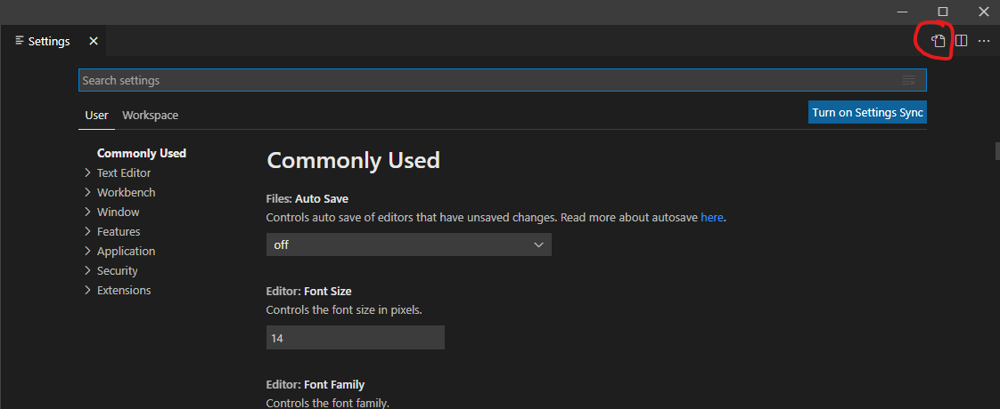
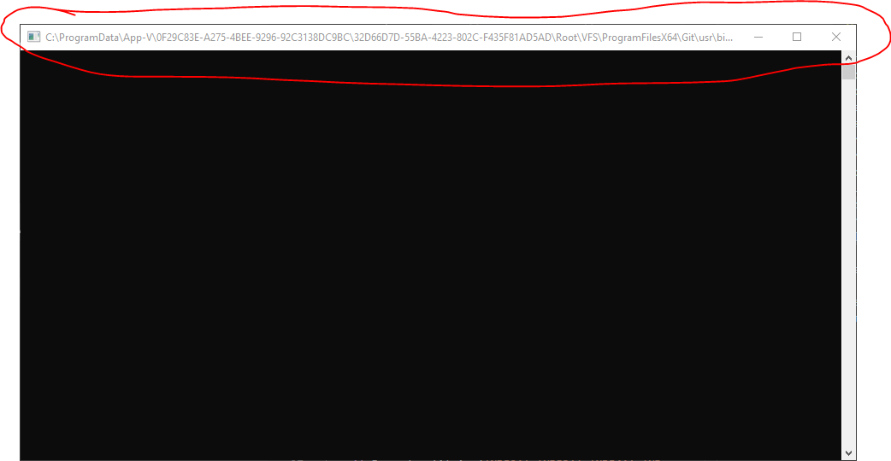

# Diverse

## Koble til virtuelt møterom

SKDE disponerer fire virtuelle møterom:

| Rom | Adresse | Alias | Nummer | Web |
| :-- | :------ | :----- | :----- | :--- |
SKDE                | 999363@uc.nhn.no | skde@vm.nhn.no | 999363 | https://join.nhn.no/webapp/conference/999363
SKDE Analyse        | 997297@uc.nhn.no | skde.analyse@vm.nhn.no   | 997297 | https://join.nhn.no/webapp/conference/997297
SKDE Forskning      | 997298@uc.nhn.no | skde.forskning@vm.nhn.no | 997298 | https://join.nhn.no/webapp/conference/997298
SKDE Servicemiljøet | 997515@uc.nhn.no |        | 997515 | https://join.nhn.no/webapp/conference/997515

Disse kan ringes opp på følgende måter, med Servicemiljøet som eksempel:

- Skype for Business: ring *997515@uc.nhn.no*
- Teams: Søk på *997515@uc.nhn.no* i søkefeltet og ring opp. Ikke mulig å dele skjerm/presentasjon hvis man bruker Teams. Må da heller koble seg på gjennom nettleser (se punkt under).
- Per telefon: ring *77602100*, slå inn konferanse-ID *997515* og avslutt med *#*
- For deltagere utenfor helsenettet eller uten Skype for Business: gå til siden https://join.nhn.no/, tast inn navnet ditt, og ring nummer *997515*. Eventuelt gå direkte til https://join.nhn.no/webapp/conference/997515
  - Denne løsningen kan fungere dårlig med Internet Explorer. Prøv eventuelt Chrome, Safari eller Firefox.
  - Løsningen fungerer ikke bak brannmuren til Helse Nord.  
- Videokonferanse over helsenettet: ring *997515*

## Teams

### Piping

Hvis man opplever kraftig piping når man ringer med Teams skyldes det som regel at **Skype** også kjører i bakgrunnen. Denne kan slås av i *Oppgavebehandling*.

Trykk `ctrl-alt-delete` og velg *Oppgavebehandling*.
Finn `Skype for Business` her og drep denne prosessen.
Det kan være den ligger under *Flere detaljer*.

### Koble seg til virtuelt møterom

Søk etter det virtuelle møterommet og velg video/telefon:


## Koble til nettverksstasjoner

For å koble til nettverksstasjon i Windows 7 gjør man følgende:

- Velg `Verktøy/Koble til nettverksstajon...` i utforskeren
- Legg inn stasjon i Feltet *Mappe*
- Velg *Koble til på nytt ved pålogging*

## Mobilt kontor – programvare og tillegg

Ved bestilling av PC med Mobilt kontor må ønsket programvare og eventuelle tillegg bestilles. På PC’er med mobilt kontor må man bruke adgangskortet og en pin-kode.

Følgende begrensninger gjelder for PC’er med mobilt kontor:

1. Det er ikke mulig å logge på maskin uten kortet. Glemmer du kortet, må du enten kjøre/sykle hjem og hente det, eventuelt få utstedt ett nytt.
2. Det er ikke mulig å opprette en lokal bruker. Uten nett kan du fortsatt bruke maskinen som om den ikke var på nett, med lokale dokumenter og programvare.

Ønsket programvare og tillegg bestilles ved bestilling av PC med mobilt kontor (lista bygges ut over tid):

- SAS
    - SAS Enterprise guide
    - SAS base
    - Add-ins for Excel
- Stata
- SPSS
- EndNote
    - Add-ins for Word
- Chrome
- Firefox
- Notepad++
- [Visual Studio Code](https://code.visualstudio.com/)
- 7Zip
- Eduroam (hvis tilknyttet UiT)
    - installasjonsfil, se https://uit.no/om/orakelet/frag?p_document_id=319282
- [git](https://git-scm.com/downloads)
- [R](https://www.r-project.org/)
- [RStudio](https://www.rstudio.com/products/RStudio)
- [Rtools](https://cran.r-project.org/bin/windows/Rtools/)
- [Python 3](https://www.python.org/downloads/)
- [MiKTeX](https://miktex.org/)
- [.NET Core Runtime](https://dotnet.microsoft.com/download#/runtime)

Kontakt HelpDesk (07022) for å bestille nye program/tillegg og fyll inn på lista over.

## Google Chrome

I forbindelse med at Google Chrome blir standard nettleser i Helse Nord blir alle utvidelser i utgangspunktet svartelistet. Det er mulig å melde ønske om hvitelisting av utvidelser 

Følgende utvidelser er hvitelistet:

- [uBlock](https://chrome.google.com/webstore/detail/ublock-origin/cjpalhdlnbpafiamejdnhcphjbkeiagm), alternativ til reklameblokkeringen *Adblock Plus*.
- *LastPass*

## Visual Studio Code

### Settings-fil

Man åpner `settings.json` ved å gå inn på *File/Preferences/Settings/* og trykke på symbolet oppe til høyre hjørne (se figur).



Husk komma etter hver linje på samme nivå, bortsett fra siste linje på gitt nivå. Eksempel:

```json
{
    "files.autoGuessEncoding": true,
    "git.enabled": true
}
```

Her har vi blant annet slått på automatisk detektering av tegnsett i filene som åpnes.

### Git for source control

På Windows10-maskiner er ikke *git* installert slik at *vscode* kan se *git*. Da kan man legge inn noe ala dette i `settings.json`:

```json
    "git.path": "c:\\ProgramData\\App-V\\0F29C83E-A275-4BEE-9296-92C3138DC9BC\\32D66D7D-55BA-4223-802C-F435F81AD5AE\\Root\\VFS\\ProgramFilesX64\\Git\\mingw64\\bin\\git.exe",
    "terminal.integrated.env.windows": {
        "PATH": "/c/ProgramData/App-V/0F29C83E-A275-4BEE-9296-92C3138DC9BC/32D66D7D-55BA-4223-802C-F435F81AD5AE/Root/VFS/ProgramFilesX64/Git/mingw64/bin/"
      },
      "terminal.integrated.profiles.windows": {
        "Custom Init": {
          "path": "c:\\ProgramData\\App-V\\0F29C83E-A275-4BEE-9296-92C3138DC9BC\\32D66D7D-55BA-4223-802C-F435F81AD5AE\\Root\\VFS\\ProgramFilesX64\\Git\\usr\\bin\\bash.exe",
        }
      },
      "terminal.integrated.windowsEnableConpty": false
```
Adressen `0F29C83E-A275-4BEE-9296-92C3138DC9BC\\32D66D7D-55BA-4223-802C-F435F81AD5AE` varierer og må settes individuelt for hver bruker. Denne kan sees hvis man åpner `git bash` og ser på vinduet som åpnes samtidig. Der vil denne adressen stå (se figur).




### Triks og tips

- Hold inne `Shift-Ctrl-Alt` og piltast ned/opp for å få markør på flere linjer samtidig (eventuelt `Shift-Alt` og venstre museknapp). `Esc` for å komme seg ut igjen. Kan så trykke *Home* eller *End* for å få alle markørene helt først eller helt sist på linjene.
- Ctrl-piltast for å hoppe ett og ett ord til siden (kan brukes sammen med trikset over).
- Shift+Alt+høyreknapp mus for å markere rektangulært område. *Obs: Windows kan velge å bytte til annet tastaturoppsett når man trykker* Shift+Alt.

### Extensions

Når man åpner en type fil i VScode, vil en få forslag til utvidelser som kan installeres. Denne listen som kommer opp kan være lang, så her er en listen over utvidelser jeg har installert:

- `Excel Viewer` av *GrapeCity*
- `LaTeX Workshop` av *James Yu*
- `Python` av *Microsoft*
- `R` av *Yuki Ueda*. Denne oppdateres dessverre ikke lenger, men har ikke funnet et fullverdig alternativ enda.
- `SAS-Syntax` av *77qingliu*

### LaTeX

*VScode* kan brukes som tekstprogram for *LaTeX*, inkludert automatisk kompilering av dokumentet tilsvarende *Overleaf*.

- Installer *MikTeX* eller lignende på maskinen.
- Installer pakkene `latexmk` og `miktex-biber-bin-x64` gjennom *MikTeX package manager*.
- Installer *vscode*-utvidelsen *LaTeX Workshop*
- Hvis dokumentet må kompileres med *lualatex* og *biber*, noe som gjelder de fleste av våre rapporter og notater, legges følgende inn helt først i dokumentet:

```tex
%! TEX program = lualatex
%! BIB program = biber
```

Hver gang en fil lagres i prosjektet, vil dokumentet kompileres. Åpne pdf-filen i *VScode* ved å trykke på tegnet med liten rød strek og forstørrelsesglass oppe til høyre i en tex-fil.

## Atom text editor

### Diverse oppsett

Gå inn på *Settings* (`ctrl-,`):

- Velg `Core` - `File encoding` og `Western (Windows 1252)` for å unngå at
*Atom* alltid åpner filene i `utf-8`.
- Velg `install`, søk etter, og installer, følgende pakker:
  - `language-sas` for å få SAS syntax.
  - `file-watcher` for at *Atom* skal oppdatere filer som lagres av andre.
  - `block-select` for å kunne markere flere linjer

### Annet

- Bruk `ctrl-shift-m` for å vise hvordan en markdown-side vil se ut.
- Hold inne `Alt`-tast og venstre museknapp for å velge flere linjer og blokk
med tekst. `block-select`-pakken må være installert for at dette skal fungere.

