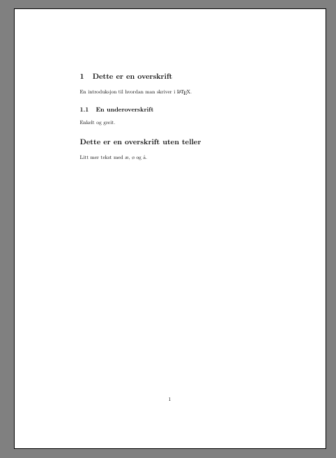

# Hvordan skrive SKDE rapport i LaTeX

## En enkel start

Dette dokumentet er omtrent så enkelt det kan bli med LaTeX

```latex
\documentclass[a4paper, norsk]{article}

\usepackage[utf8]{inputenc}
\usepackage[norsk]{babel}
\usepackage{parskip}

\begin{document}

\section{Dette er en overskrift}

En introduksjon til hvordan man skriver i \LaTeX.

\subsection{En underoverskrift}

Enkelt og greit.

\section*{Dette er en overskrift uten teller}

Litt mer tekst med æ, ø og å.

\end{document}
```  
Dette vil gi et dokument som ser slik ut:  


- Et LaTeX-dokument starter alltid med `documentclass`. Her spesifiserer man hva slags dokument man skal skrive (article/report/book) og gir noen instillinger (at dokumentet er på norsk og at det er A4). 
- Man legger så inn noen pakker man vil bruke. Her har jeg brukt pakken `inputenc` med valget `utf8` for å kunne skrive æ, ø og å. Jeg bruker i tillegg pakken `babel` med valg `norsk`, for å bryte ord riktig ved tvunget linjeskift. Til slutt bruker jeg pakken `parskip` for å få rom mellom avsnitt.
- Mellom `\begin{document}` og `\end{document}` skriver man inn selve teksten.
- Overskrifter og underoverskrifter skrives i `\section{}` og `\subsection{}`.

Kopier teksten inn i et nytt dokument i TeXmaker, lagre det, og trykk på `F6`. Dokumentet blir da kompilert og lager en pdf. pdf-filen kan åpnes ved å trykke `F7`. 

### Diverse man må huske

- 40 % skrives `40\,\%`
- "friske" skrives `<<friske>>`
- én skrives `{\'e}n`


## En SKDE-rapport

Denne her: [rapport barnehelseatlas](http://www.helseatlas.no/getfile.php/SKDE%20INTER/Helseatlas/rapport_digitalt.pdf)

### Oppsett


```latex
\documentclass[norsk, 11pt, a4paper]{book}

\def \figurbredde {0.8\textwidth}
\def \captionbredde {1.0\textwidth}

\usepackage[norsk]{babel}
\usepackage[utf8x]{inputenc}
\usepackage[T1]{fontenc}

\usepackage{natbib}
\usepackage{bibtopic} % to referanselister

\usepackage{multicol}
\usepackage{graphicx}
\usepackage[labelfont=bf, font=scriptsize, width=\captionbredde, justification=justified,singlelinecheck=false]{caption} %instillinger for figurtekster

\usepackage{appendix}
\usepackage{xcolor}
\usepackage{verbatim}
\usepackage[bottom = 2.50cm]{geometry}
\usepackage{parskip}

% for tabeller
\usepackage{booktabs}
\usepackage{longtable}
\usepackage{rotating}
\usepackage{tabularx}

\usepackage{lipsum} % latin
\usepackage{textcomp} %copyright symbol
\usepackage{footmisc} %flere fotnoter

\usepackage{emptypage}
\usepackage{afterpage} % bedre clearpage?
\usepackage{pdfpages} % for å legge inn forside/bakside

\usepackage{fancyhdr}
\pagestyle{fancy}
\fancyhf{}
\fancyhead[lo]{\nouppercase{\rightmark}}
\fancyhead[re]{\nouppercase{\leftmark}}
\fancyhead[ro,le]{\thepage}
\setlength{\headheight}{14pt}

\definecolor{skde}{RGB}{0,80,158}
\definecolor{lysblaa}{rgb}{0.27,0.51,0.71}

\usepackage[colorlinks, citecolor=skde, linkcolor=skde, urlcolor=lysblaa]{hyperref} % brukes for nettutgaven

%\usepackage[colorlinks, citecolor=black, linkcolor=black, urlcolor=black]{hyperref} % brukes for printutgaven

% farge på overskrifter
\usepackage{sectsty}
\chapterfont{\color{skde}}  % sets colour of chapters
\sectionfont{\color{skde}}  % sets colour of sections
\subsectionfont{\color{skde}}  % sets colour of sections
\subsubsectionfont{\color{skde}}  % sets colour of sections

% for å få siste side til å være partall
\makeatletter
\def\cleartoleftpage{\clearpage\if@twoside \ifodd\c@page
\hbox{}\newpage\if@twocolumn\hbox{}\newpage\fi\fi\fi}
\makeatother

% Flere figurer per side etc
\renewcommand{\topfraction}{0.95}	% max fraction of floats at top
\renewcommand{\bottomfraction}{0.95}	% max fraction of floats at bottom
\renewcommand{\textfraction}{0.05}	% allow minimal text w. figs
\renewcommand{\floatpagefraction}{.8} %only pages with more than 80% of floats, will become pure float-only pages. The default is 0.6

% legge figurer på topp av float-only sider
\makeatletter
\setlength{\@fptop}{0pt}
\setlength{\@fpbot}{0pt plus 1fil}
\makeatother

```

### Selve dokumentet

Bruker `\input{filnavn}` for å legge inn andre LaTeX-fileri, der all teksten ligger. "side2" er gitt [under](#side2tex).

```latex
\begin{document}

\pagenumbering{arabic}
\pagestyle{empty}

\includepdf[pages={1}]{omslag.pdf}

\input{side2}

\input{forord}

\input{forord_blf}

\newgeometry{top=2.3cm}

\makeatletter
\@openrightfalse
\tableofcontents
\@openrighttrue
\makeatother
\restoregeometry


\pagestyle{fancy}

\input{sammendrag}

\input{introduksjon}

\input{helsetjenester}

\input{data_utvalg_metode}

\input{resultater}

\input{diskusjon}

\bibliographystyle{apalike2}

\begin{btSect}{referanser}

\chapter*{Referanser}
\addcontentsline{toc}{chapter}{Referanser}%\clearpage
\markboth{Referanser}{}
\btPrintCited

\chapter*{Øvrig litteratur}
\addcontentsline{toc}{chapter}{Øvrig litteratur}
\markboth{Øvrig litteratur}{}
\btPrintNotCited
\end{btSect}

\input{appendiks}

\cleartoleftpage

\includepdf[pages={2}]{omslag.pdf}

\end{document}
```

### Andre dokumenter

Dokumentet [over](#selve-dokumentet) krever at man har filene "side2.tex", "forord.tex", "forord_blf.tex", "sammendrag.tex" etc. i samme mappe som hoveddokumentet. I tillegg må man ha et to-siders pdf-dokument ("omslag.pdf") der side 1 er forsiden og side 2 er baksiden av rapporten.

#### side2.tex

Lagt i egen fil kalt `side2.tex`

```latex
\newgeometry{bottom=2cm, right=2cm}

\null
\vfill


\begin{small}
{\color{skde}
\begin{tabularx}{0.46\paperwidth}{lX}
SKDE rapport    & Nr. 2/2015\\
Hovedforfatter & Atle Moen \\
Fungerende redaktør & Barthold Vonen \\
Ansvarlig redaktør & Olav Helge Førde\\
Medforfattere   & Bård Uleberg, Frank Olsen, Arnfinn Hykkerud Steindal, Petter Otterdal, Trygve Deraas, Trine Magnus og Lise Balteskard\\
Oppdragsgiver   & Helse- og omsorgsdepartementet og Helse Nord RHF\\
Gradering       & Åpen  \\
Dato            & September 2015\\
Versjon         & \today \\
\\
\multicolumn{2}{l}{Dokumentet skrevet i \LaTeX} \\
\multicolumn{2}{l}{Figurer produsert med SAS\textsuperscript{\textregistered}}\\
\multicolumn{2}{l}{Forsidefoto: Shutterstock} \\
\\
\multicolumn{2}{l}{\bf{ISBN:} \bf{978-82-93141-17-4}}\\
\\
\multicolumn{2}{l}{Alle rettigheter SKDE.}
\end{tabularx}
}
\end{small}

\restoregeometry

```

#### forord.tex

Forordet kan se slik ut  
```latex
\chapter*{Forord}

\lipsum

\lipsum

\vspace{1cm}

\begin{flushleft}
Bodø 24.09.2015\\
\vspace{0.5cm}
 NAVN NAVNSEN\\
Administrerende direktør\\
Helse Nord RHF\\
\end{flushleft}

\thispagestyle{empty}

```

#### sammendrag.tex

sammendrag.tex begynner slik

```latex
\chapter{Sammendrag} 

\lipsum

```

#### introduksjon.tex

introduksjon.tex begynner slik

```latex
\chapter{Introduksjon}

\section{Om variasjon i bruk av helsetjenester}

\subsection{Bakgrunn}

\lipsum

```

## BibTeX

Når man legger inn referanser i LaTeX bruker man som regel bibtex. Da lager man en egen fil som heter noe som ender på `.bib`. I denne skrives alle referansene, omtrent slik som dette:
```latex

@article{Adler2013,
author = {Adler, Jeremy and Sandberg, Kelly C. and Shpeen, Benjamin H. and Eder, Sally J. and Dhanani, Muhammad and Clark, Sarah J. and Freed, Gary L},
title = {Variation in {I}nfliximab Administration Practices in the Treatment of Pediatric Inflammatory Bowel Disease},
journal = "J Pediatr. Gastroenterol. Nutr.",
year = {2013},
volume = {57},
number = {1},
pages = {35-38},
}


@misc{dagkir,
author = {Lise Balteskard and Trygve Deraas and Olav Helge Førde and Trine Magnus and Frank Olsen and Bård Uleberg},
title = {Dagkirurgi i {N}orge 2011-2013, utvalgte inngrep},
month = {Januar},
year = {2015},
isbn = {978-82-93141-16-7},
note = {{ISBN:} 978-82-93141-16-7}
}

```

- `Adler2013` og `dagkir` er "nøkkelen" man bruker for å sitere disse referansene i teksten. Det gjør man ved å skrive "\cite{Adler2013}" der man vil putte siteringen.
- Man skiller forfattere med "and"
- Alt, bortsett fra første bokstav, i tittel blir små bokstaver, så hvis man vil beholde stor bokstav må bokstaven "beskyttes" med klammeparantes (som i {I}nfliximab).
- Når man skal kompilere LaTeX-dokumentet når man bruker bibtex må man gjøre dette flere ganger for at alt skal bli riktig. I TeXmaker må man typisk gjøre følgende: `F6`, `F11`, `F6`, `F6` (`F11` for å kompilere bibtex-filen).
- Å finne "riktig" referansestil, både i tekst og i referanselisten til slutt, kan være litt pes. Kan være lurt å bruke enten `natbib` eller `biblatex`.
- Se ellers annen bibtex-dokumentasjon på nett.
- I barnehelseatlasrapporten ville vi ha to referanselister: en for de som ble sitert i teksten og en for resten av artiklene i vår bib-fil. Dette ble gjort ved bruk av pakken `bibtopic` og det som står etter `\begin{btSect}`.
