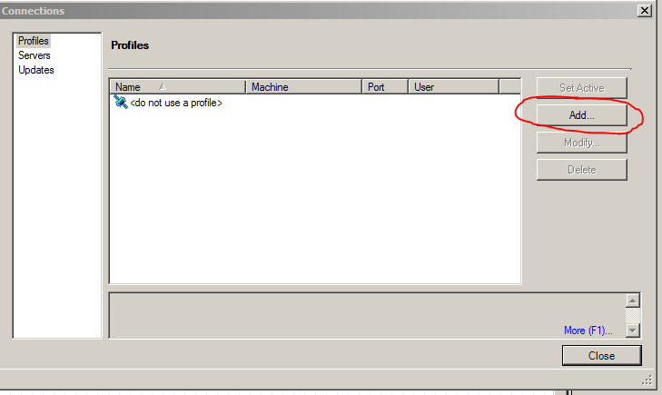
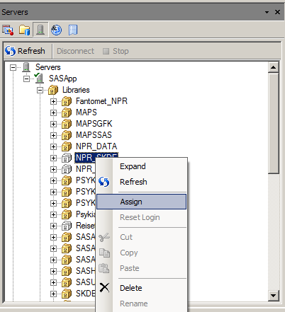
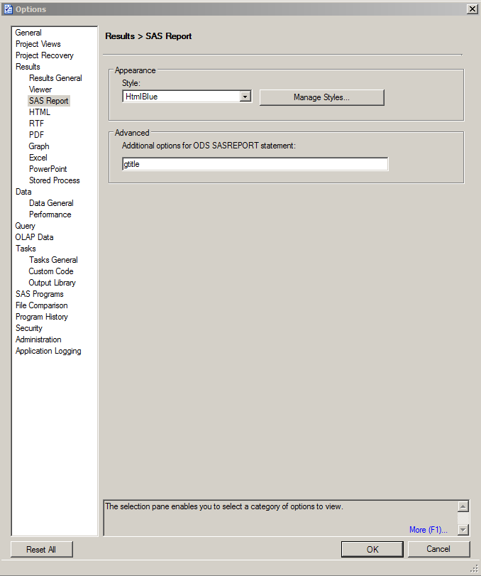
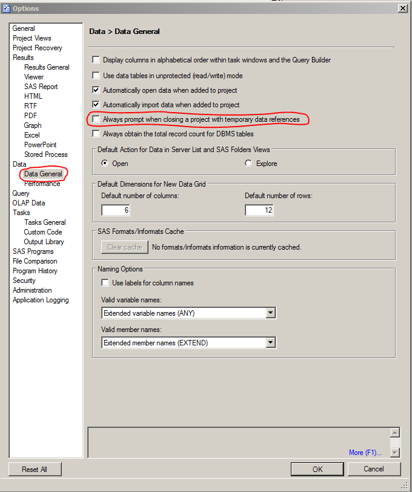

# Huskeliste for arbeid med SAS på SKDE

## Lagring av sensitive datasett

- Sensitive datasett skal *kun* lagres på npr_utva! Disse skal slettes hvert år, når vi får nye data i hus
```sas
data mittutvalg;
set npr_utva.ahs_utvalg1;

...

run;
```

## Overgang til ny sas-server

- Koble til ny server i SAS Enterprise guide






- Makroer, formater etc. er nå flyttet til den nye serveren. Det som ligger på ANALYSE/data brukes ikke lenger. `filbane` må derfor endres, og resten skal fungere stort sett som før
```
%let filbane=\\tos-sas-skde-01\skde_sas\;
```

## Macroer

### Laste inn vår egen autocomplete-fil

- Dette gjøres slik at man kan enkelt få inn rateprogram etc. i sas-prosjektet

1. Gå inn på *Program/Editor Macros/Macros*
2. *Import...*
3. Gå inn på `E:\ANALYSE\Data\SAS\Makroer\Abb_macro` og velg *Auto_Makro.kmf*
4. *Close*
5. Med ujevne mellomrom oppdateres *Abb_macro*, og man må da kjøre stegene 1 til 4 på nytt. Vi får prøve å gi beskjed om dette internt...

- Hvis man nå begynner å skrive `auto` vil *AUTO_MACRO* kommer opp i en liste.
- Hvis man velger denne, vil følgende tekst legge seg inn i sas-programmet ditt
```
%let filbane=\\hn.helsenord.no\UNN-Avdelinger\SKDE.avd\Analyse\Data\SAS\;
options sasautos=("&filbane.Makroer" SASAUTOS);
```

### Lage en makro

- En makro kan se omtrent slik ut:
```
%macro macronavn(datasett=);

data &datasett;
run &datasett;
...
*gjør noe her med datasettet;
...

%mend macronavn;
```
- Hvis man lagrer en fil med navn `macronavn.sas` i `ANALYSE/Data/SAS/Makroer/` kan andre bruke denne hvis de har kjørt følgende kode i SAS-prosjektet:
```
%let filbane=\\hn.helsenord.no\UNN-Avdelinger\SKDE.avd\Analyse\Data\SAS\;
options sasautos=("&filbane.Makroer" SASAUTOS);
```

## Formater

- Bruk de formatene som ligger under `ANALYSE/Data/SAS/Formater/master/`, som f.eks
```
%include "&filbane.Formater\master\SKDE_somatikk.sas";
%include "&filbane.Formater\master\bo.sas";
%include "&filbane.Formater\master\beh.sas";
```
- Hvis man vil ha spesialtilpasset macro, kan man enten 
  - kopiere over det som står i en av sas-filene som ligger på master rett inn i programmet sitt, eller
  - kopiere mappen `master` og endre direkte i den nye mappen.

## Rateprogrammet


  
## Annet

### gtitle

For at tittel skal bli lagt på figurene som produseres i SAS, må følgende gjøres i SAS Enterprise Guide:

- Gå inn på `Tools/Options...` og skriv inn følgende:


### Redusere størrelsen på datasett

Alle verdier lagres som standard med 8 bytes. Dette er i de fleste av våre tilfeller ikke nødvendig. SAS kan redusere plassen hvert tall tar på disk ned til 3 bytes. I tillegg har SAS verktøy for å komprimere datasett.

- Hvis man vil redusere størrelsen på en variabel til 3 bytes, legger man inn følgende i et datasteg:
```
length variabelnavn 3;
```
- Jeg har lagt til en macro som heter squeeze, som finner ut hvor liten plass hver variabel kan reduseres til, og reduserer antall bytes tilsvarende (denne har jeg ikke skrevet selv). Den kjøres slik:
```
%squeeze(inndata, utdata);
```
- Hvis man vil komprimere datasett, gjør man følgende (dette vil føre til at SAS bruker lenger tid på å lese datasettet neste gang, siden datasettet må pakkes opp igjen):
```
data komprimertDatasett (compress=binary);
set ukomprimertDatasett;
run;
```
- Det er også mulig med `compress=yes` og `compress=char`

Jeg har kjørt ulike komprimeringer på et årssett (2011) og fått følgende størrelser:

- Originalt:  8.99 GB 
- Squeeze (%squeeze): 5.53 GB
- Compress (yes): 3.34 GB
- Compress (char): 3.34 GB
- Compress (binary): 2.68 GB
- Squeeze-Compress (%squeeze/binary): 2.37 GB

## Diverse engangs-oppgaver

### Koble til server i SAS Enterprise Guide

- Gå på `Tools/Connections...`
- Legg til en profil. Den skal se noe slik ut, med maskinnavn `TOS-SASTEST-07`


### Legge SAS-server til utforsker

- Gå på `Verktøy/Koble til nettverkstasjon`
- Stasjon: `Z` (ikke kritisk, men de fleste andre har valgt Z)
- Mappe: `\\tos-sastest-07\SKDE`

### Slå av advarsel om sletting av midlertidig datasett

- Gå inn på `Tools/Options.../Data/Data General/` og huk vekk `Always prompt when closing...`



### SAS-syntax i Notepad++

- Legg følgende i en fil kalt `UserDefineLang.xml` og lagre den (sannsynligvis) i mappen `C:\Users\<ditt brukernavn>\AppData\Roaming\Notepad++` (hvis filen finnes allerede, legger man inn innholdet mellom de eksisterende <NotepadPlus>):
```xml
<NotepadPlus>
    <UserLang name="SAS" ext="sas SAS" udlVersion="2.0">
        <Settings>
            <Global caseIgnored="yes" allowFoldOfComments="no" forceLineCommentsAtBOL="yes" foldCompact="yes" />
            <Prefix Keywords1="no" Keywords2="no" Keywords3="no" Keywords4="yes" Keywords5="yes" Keywords6="no" Keywords7="no" Keywords8="yes" />
        </Settings>
        <KeywordLists>
            <Keywords name="Comments" id="0">00* 01 02; 03/* 04*/</Keywords>
            <Keywords name="Numbers, additional" id="1">- -- :</Keywords>
            <Keywords name="Numbers, prefixes" id="2"></Keywords>
            <Keywords name="Numbers, extras with prefixes" id="3"></Keywords>
            <Keywords name="Numbers, suffixes" id="4"></Keywords>
            <Keywords name="Operators1" id="5">&apos; - ! &quot; &amp; ( ) , . : ; ? @ [ \ ] ^ ` { | } ~ + &lt; &gt;</Keywords>
            <Keywords name="Operators2" id="6"></Keywords>
            <Keywords name="Folders in code1, open" id="7">%MACRO</Keywords>
            <Keywords name="Folders in code1, middle" id="8"></Keywords>
            <Keywords name="Folders in code1, close" id="9">%MEND;</Keywords>
            <Keywords name="Folders in code2, open" id="10"></Keywords>
            <Keywords name="Folders in code2, middle" id="11"></Keywords>
            <Keywords name="Folders in code2, close" id="12"></Keywords>
            <Keywords name="Folders in comment, open" id="13">region</Keywords>
            <Keywords name="Folders in comment, middle" id="14">rrr</Keywords>
            <Keywords name="Folders in comment, close" id="15">rend</Keywords>
            <Keywords name="Keywords1" id="16">append bmdp calendar catalog chart cimport compare contents convert copy corr cport datasets format forms freq glm gplot logistic means npar1way options pds plot pmenu print printto rank release sort source spell sql standard summary tabulate tapecopy tapelabel timeplot transpose ttest univariate v5tov6&#x000D;&#x000A;DATA PROC quit run</Keywords>
            <Keywords name="Keywords2" id="17">$include _all_ _character_ _cmd_ _error_ _freq_ _i_ _infile_ _last_ _msg_ _n_ _null_ _numeric_ _temporary_ _type_ abort addr adjrsq alpha alter altlog altprint array as attrib authserver autoexec awscontrol awsdef awsmenu awsmenumerge awstitle backward base blocksize bufno bufsize by byerr byline call cards cards4 catcache cbufno center change chisq class cleanup cntllev codegen col collin column comamid comaux1 comaux2 comdef config continue cpuid create datalines datalines4 dbcslang dbcstype ddm delete delimiter descending device dflang display distinct dkricond dkrocond dlm do drop dsnferr echo else emaildlg emailid emailpw emailserver emailsys encrypt end endsas engine eof eov error errorcheck errors feedback file fileclose filefmt filevar first first. firstobs fmterr fmtsearch font fontalias footnote footnote1 footnote2 footnote3 footnote4 footnote5 footnote6 footnote7 footnote8 footnote9 force formatted formchar formdelim formdlim forward from go goto group gwindow hbar helpenv helploc honorappearance hostprint hpct html hvar ibr id if infile informat initcmd initstmt inr into invaliddata is join keep kentb label last last. leave lib library line linesize link list lostcard lrecl ls macro macrogen maps mautosource maxdec maxr measures median memtype merge merror missing missover mlogic mode model modify mprint mrecall msglevel msymtabmax mvarsize myy new news no nobatch nobs nocol nocaps nocardimage nocenter nocharcode nocmdmac nocum nodate nodbcs nodetails nodmr nodms nodmsbatch nodup nodupkey noduplicates noechoauto noequals noerrorabend noexitwindows nofullstimer noicon noimplmac noint nolist noloadlist nomiss nomlogic nomprint nomrecall nomsgcase nomstored nomultenvappl nonotes nonumber noobs noovp nopad noprint noprintinit norow norsasuser nosetinit nosource2 nosplash nosymbolgen notes notitle notitles notsorted noverbose noxsync noxwait number numkeys nummousekeys nway obs ods on option order otherwise out outp= output over ovp pad pad2 page pageno pagesize paired parm parmcards path pathdll pfkey position printer probsig procleave prt ps pw pwreq r ranks read recfm reg register regr remote remove rename replace retain return reuse rsquare rtf rtrace rtraceloc s s2 samploc sasautos sascontrol sasfrscr sashelp sasmsg sasmstore sasscript sasuser select selection separated seq serror set setcomm simple siteinfo skip sle sls sortedby sortpgm sortseq sortsize source2 splashlocation split spool start stdin stimer stop stopover sumwgt symbol symbolgen sysin sysleave sysparm sysprint sysprintfont t table tables tapeclose tbufsize terminal test then title title1 title2 title3 title4 title5 title6 title7 title8 title9 to tol tooldef trantab truncover type unformatted union until update user usericon validate value var varray varrayx vformat vformatd vformatdx vformatn vformatnx vformatw vformatwx vformatx vinarray vinarrayx vinformat vinformatd vinformatdx vinformatn vinformatnx vinformatw vinformatwx vinformatx vlabel vlabelx vlength vlengthx vname vnamex vnferr vtype vtypex weight when where while wincharset window work workinit workterm write x xsync xwait yearcutoff yes abs airy all arcos arsin atan attrc attrn band betainv blshift bnot bor brshift bxor byte cdf ceil cexist cinv close cnonct collate compbl compound compress cos cosh css curobs cv daccdb daccdbsl daccsl daccsyd dacctab dairy date datejul datepart datetime day dclose depdb define depdbsl depsl depsyd deptab dequote dhms dif digamma dim dinfo dnum dopen doptname doptnum dread dropnote dsname erf erfc exist exp fappend fclose fcol fdelete fetch fetchobs fexist fget fileexist filename fileref finfo finv fipname fipnamel fipstate floor fnonct fnote fopen foptname foptnum fpoint fpos fput fread frewind frlen fsep full fuzz fwrite gaminv gamma getoption getvarc getvarn hbound hms hosthelp hour ibessel index indexc indexw inner input inputc inputn int intck intnx intrr irr jbessel juldate kurtosis lag lbound left length lgamma libname libref log log10 log2 logpdf logpmf logsdf lowcase max mdy mean min minute mod month mopen mort n netpv nmiss normal note npv open ordinal outer pathname pdf peek peekc pmf point poisson poke probbeta probbnml probchi probf probgam probhypr probit probnegb probnorm probt put putc putn qtr quote ranbin rancau ranexp rangam range rannor ranpoi rantbl rantri ranuni repeat resolve reverse rewind right round saving scan sdf second sign sin sinh skewness soundex spedis sqrt std stderr stfips stname stnamel substr sum symget symput sysget sysmsg sysprod sysrc system tan tanh time timepart tinv tnonct today translate tranwrd trigamma trim trimn trunc uniform upcase uss varfmt varinfmt varlabel varlen varname varnum vartype verify weekday year yyq zipfips zipname zipnamel zipstate crosstab descript design= levels nest setot subgroup subpopn totper wsum</Keywords>
            <Keywords name="Keywords3" id="18">%bquote %do %else %end %eval %global %goto %if %inc %include %index %input %length %let %list %local %macro %mend %nrbquote %nrquote %nrstr %put %qscan %qsysfunc %quote %run %substr %syscall %sysevalf %sysexec %sysfunc %sysrc %then %to %until %while %window</Keywords>
            <Keywords name="Keywords4" id="19">~</Keywords>
            <Keywords name="Keywords5" id="20">% &amp;</Keywords>
            <Keywords name="Keywords6" id="21">$1 $2 $3 $4 $5 $6 $7 $8 $9 $ascii $binary $cb $char $charzb $ebcdic $hex $kanji $kanjix $msgcase $octal $phex $quote $reverj $revers $upcase $varying&#x000D;&#x000A;&#x000D;&#x000A;best binary bits bz cb char comma commax dateampm ddmmyy dollar dollarx downame eurdfdd eurdfde eurdfdn eurdfdt eurdfdwn eurdfmn eurdfmy eurdfwdx eurdfwkx float fract hex hhmm ib ieee julday julian minguo mmddyy mmss mmyy monname monyy msec negparen nengo numx octal pd pdjulg pdjuli pdtime percent pib pk punch pvalue qtrr rb rmfdur rmfstamp roman row s370ff s370fib s370fibu s370fpd s370fpdu s370fpib s370frb s370fzd s370fzdl s370fzds s370fzdt s370fzdu smfstamp timeampm tod tu vaxrb weekdate weekdatx worddate worddatx wordf words yen yymm yymmdd yymon yyqr z zd zdb zdv</Keywords>
            <Keywords name="Keywords7" id="22">For each Parse and or between next take in count not</Keywords>
            <Keywords name="Keywords8" id="23">@</Keywords>
            <Keywords name="Delimiters" id="24">00&quot; 01 02&quot; 03&apos; 04 05&apos; 06( 07 08) 09&apos; 10 11&apos;d 12[ 13 14] 15??? 16; 17??? 18 19 20 21 22 23</Keywords>
        </KeywordLists>
        <Styles>
            <WordsStyle name="DEFAULT" styleID="0" fgColor="000000" bgColor="FFFFFF" fontName="&#xFFFF;&#x0013;&#x08A2;&#x0005;&#x6FA3;&#x5534;s&#x8A00;&#x6150;&#x7372;e&#x2E01;&#x6FA1;&#x5534;.&#x8000;R" fontStyle="0" nesting="0" />
            <WordsStyle name="COMMENTS" styleID="1" fgColor="008000" bgColor="FFFFCA" fontName='&quot;ourier New' fontStyle="2" fontSize="10" nesting="139296" />
            <WordsStyle name="LINE COMMENTS" styleID="2" fgColor="008000" bgColor="FFFFFF" fontName="&amp;ourier New" fontStyle="2" nesting="139552" />
            <WordsStyle name="NUMBERS" styleID="3" fgColor="008080" bgColor="FFFFFF" fontName="&#x0002;" fontStyle="1" nesting="0" />
            <WordsStyle name="KEYWORDS1" styleID="4" fgColor="000080" bgColor="FFFFFF" fontName="N" fontStyle="1" nesting="0" />
            <WordsStyle name="KEYWORDS2" styleID="5" fgColor="0000FF" bgColor="FFFFFF" fontName="z&#x0013;" fontStyle="0" nesting="0" />
            <WordsStyle name="KEYWORDS3" styleID="6" fgColor="008080" bgColor="FFFFFF" fontName="|&#x0013;&#xA8A8;&#x0013;&#x6FE9;&#x5534;" fontStyle="0" nesting="0" />
            <WordsStyle name="KEYWORDS4" styleID="7" fgColor="FF8000" bgColor="FFFFFF" fontName="L&#x0013;" fontStyle="1" nesting="0" />
            <WordsStyle name="KEYWORDS5" styleID="8" fgColor="000000" bgColor="FFFFFF" fontName="J" fontStyle="3" nesting="0" />
            <WordsStyle name="KEYWORDS6" styleID="9" fgColor="008080" bgColor="FFFFFF" fontName="R" fontStyle="0" nesting="0" />
            <WordsStyle name="KEYWORDS7" styleID="10" fgColor="FF0000" bgColor="FFFFFF" fontName="&#x0006;&#x2201;&#x1368;&#x01E6;&#x6FAD;&#x5534;&#x433B;&#x8C00;&#xA86C;&#x0013;&#x0001;" fontStyle="1" nesting="0" />
            <WordsStyle name="KEYWORDS8" styleID="11" fgColor="FF80C0" bgColor="FFFFFF" fontName="&#x0008;&#x2201;&#x7379;&#x6574;&#x6FA9;&#x5534;&#x6257;&#x8000;&#x000C;&#x2200;&#x6957;&#x646E;&#x6F97;&#x5534;&#x7953;&#x8000;&#x000E;&#x2101;_C&#x6F95;&#x5534;" fontStyle="3" nesting="0" />
            <WordsStyle name="OPERATORS" styleID="12" fgColor="000000" bgColor="FFFFFF" fontName="&#x000C;&#x2200;&#x6957;&#x646E;&#x6F97;&#x5534;&#x7953;&#x8000;&#x000E;&#x2101;_C&#x6F95;&#x5534;" fontStyle="0" nesting="0" />
            <WordsStyle name="FOLDER IN CODE1" styleID="13" fgColor="000080" bgColor="FFFFFF" fontName="&#x000E;&#x2101;_C&#x6F95;&#x5534;" fontStyle="1" nesting="0" />
            <WordsStyle name="FOLDER IN CODE2" styleID="14" fgColor="000000" bgColor="FFFFFF" fontName="&#x0010;&#x2101;&#x6C6C;&#x765C;&#x6F93;&#x5534;&#x433B;&#x8000;&#x0016;" fontStyle="7" nesting="0" />
            <WordsStyle name="FOLDER IN COMMENT" styleID="15" fgColor="008000" bgColor="FFFFFF" fontName="Nide Latin" fontStyle="3" nesting="0" />
            <WordsStyle name="DELIMITERS1" styleID="16" fgColor="800080" bgColor="FFFFFF" fontName="&#x0012;&#x2100;&#x5353;&#x524F;&#x6FF7;&#x5534;&#x4948;&#x8C00;&#xA8E4;&#x0013;" fontStyle="0" nesting="0" />
            <WordsStyle name="DELIMITERS2" styleID="17" fgColor="800080" bgColor="FFFFFF" fontName=".&#x2301;&#x2E3B;&#x5357;&#x6F89;&#x5534;&#x4353;&#x8000;&#x0012;&#x2100;&#x5353;&#x524F;&#x6FF7;&#x5534;&#x4948;&#x8C00;&#xA8E4;&#x0013;" fontStyle="0" nesting="0" />
            <WordsStyle name="DELIMITERS3" styleID="18" fgColor="000000" bgColor="C0C0C0" fontName=",&#x2300;_C&#x6F8B;&#x5534;" fontStyle="0" nesting="0" />
            <WordsStyle name="DELIMITERS4" styleID="19" fgColor="008080" bgColor="FFFFFF" fontName="*&#x2401;&#xEF6B;" fontStyle="1" nesting="0" />
            <WordsStyle name="DELIMITERS5" styleID="20" fgColor="000000" bgColor="FF0000" fontName="v&#x2400;&#xCC18;M&#x6E31;&#x5534;" fontStyle="0" nesting="0" />
            <WordsStyle name="DELIMITERS6" styleID="21" fgColor="000000" bgColor="FF8000" fontName="t" fontStyle="1" nesting="0" />
            <WordsStyle name="DELIMITERS7" styleID="22" fgColor="000000" bgColor="FFFFFF" fontName="r&#x2300;&#x7461;&#x5C61;&#x6E35;&#x5534;&#xA415;&#x8000;t" fontStyle="0" nesting="0" />
            <WordsStyle name="DELIMITERS8" styleID="23" fgColor="000000" bgColor="FFFFFF" fontName="p" fontStyle="0" nesting="0" />
        </Styles>
    </UserLang>
</NotepadPlus>
```

- Restart Notepad++ og gå inn på `Språk`. Der kan man velge `SAS` nest nederst.

