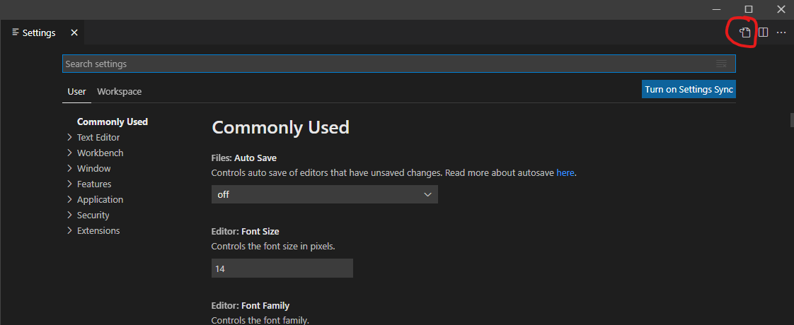
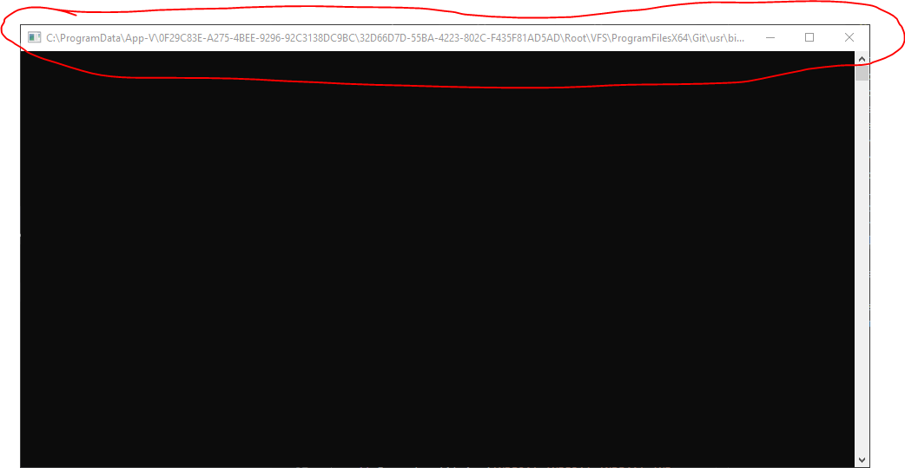

# Visual Studio Code

## Settings-fil

Man åpner `settings.json` ved å gå inn på *File/Preferences/Settings/* og trykke på symbolet oppe til høyre hjørne (se figur).



Husk komma etter hver linje på samme nivå, bortsett fra siste linje på gitt nivå. Eksempel:

```json
{
    "files.autoGuessEncoding": true,
}
```

Her har vi blant annet slått på automatisk detektering av tegnsett i filene som åpnes.

## Git for source control

På Windows10-maskiner er ikke *git* installert slik at *vscode* kan se *git*. Da kan man legge inn noe ala dette i `settings.json`:

```json
    "git.enabled": true,
    "git.path": "c:\\ProgramData\\App-V\\0F29C83E-A275-4BEE-9296-92C3138DC9BC\\32D66D7D-55BA-4223-802C-F435F81AD5AE\\Root\\VFS\\ProgramFilesX64\\Git\\mingw64\\bin\\git.exe",
```

Adressen `0F29C83E-A275-4BEE-9296-92C3138DC9BC\\32D66D7D-55BA-4223-802C-F435F81AD5AE` varierer og må settes individuelt for hver bruker. Denne kan sees hvis man åpner `git bash` og ser på vinduet som åpnes samtidig. Der vil denne adressen stå (se figur).



## Bruke git-bash som terminal

```json
    "terminal.integrated.env.windows": {
        "PATH": "/c/ProgramData/App-V/0F29C83E-A275-4BEE-9296-92C3138DC9BC/32D66D7D-55BA-4223-802C-F435F81AD5AE/Root/VFS/ProgramFilesX64/Git/mingw64/bin/"
      },
    "terminal.integrated.profiles.windows": {
      "Custom Init": {
        "path": "c:\\ProgramData\\App-V\\0F29C83E-A275-4BEE-9296-92C3138DC9BC\\32D66D7D-55BA-4223-802C-F435F81AD5AE\\Root\\VFS\\ProgramFilesX64\\Git\\usr\\bin\\bash.exe",
        "args": ["-l"]
      }
    },
    "terminal.integrated.defaultProfile.windows": "Custom Init",
    "terminal.integrated.windowsEnableConpty": false
```

Jeg fikk en feilmelding hvis jeg ikke satt `windowsEnableConpty` til `false`. Mulig dette vil endre seg i fremtiden.

## Triks og tips

- Hold inne `Shift-Ctrl-Alt` og piltast ned/opp for å få markør på flere linjer samtidig (eventuelt `Shift-Alt` og venstre museknapp). `Esc` for å komme seg ut igjen. Kan så trykke *Home* eller *End* for å få alle markørene helt først eller helt sist på linjene.
- Ctrl-piltast for å hoppe ett og ett ord til siden (kan brukes sammen med trikset over).
- Shift+Alt+høyreknapp mus for å markere rektangulært område. *Obs: Windows kan velge å bytte til annet tastaturoppsett når man trykker* Shift+Alt.

## Extensions

Når man åpner en type fil i VScode, vil en få forslag til utvidelser som kan installeres. Denne listen som kommer opp kan være lang, så her er en listen over utvidelser jeg har installert:

- `Excel Viewer` av *GrapeCity*
- `LaTeX Workshop` av *James Yu*
- `Python` av *Microsoft*
- `R` av *Yuki Ueda*. Denne oppdateres dessverre ikke lenger, men har ikke funnet et fullverdig alternativ enda.
- `SAS-Syntax` av *77qingliu*

## LaTeX

*VScode* kan brukes som tekstprogram for *LaTeX*, inkludert automatisk kompilering av dokumentet tilsvarende *Overleaf*.

- Installer *MikTeX* eller lignende på maskinen.
- Installer pakkene `latexmk` og `miktex-biber-bin-x64` gjennom *MikTeX package manager*.
- Installer *vscode*-utvidelsen *LaTeX Workshop*
- Hvis dokumentet må kompileres med *lualatex* og *biber*, noe som gjelder de fleste av våre rapporter og notater, legges følgende inn helt først i dokumentet:

```tex
%! TEX program = lualatex
%! BIB program = biber
```

Hver gang en fil lagres i prosjektet, vil dokumentet kompileres. Åpne pdf-filen i *VScode* ved å trykke på tegnet med liten rød strek og forstørrelsesglass oppe til høyre i en tex-fil.
